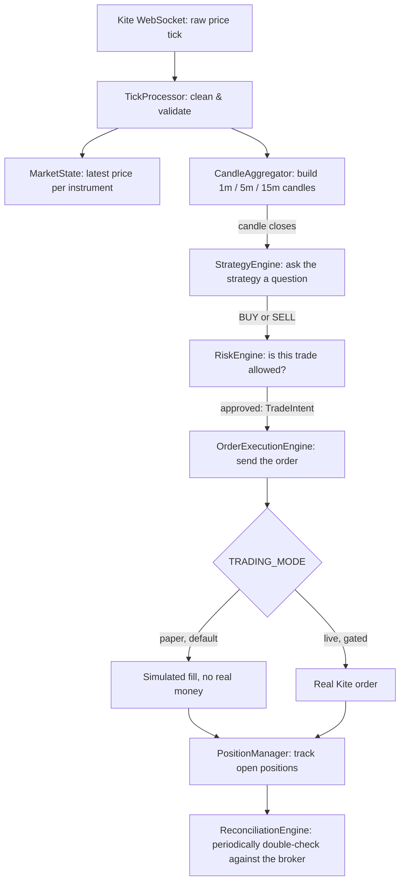

# Flow & Worked Examples

> **New to this project? Start here.** This page explains, in plain
> language, what happens when the application runs, how a tick turns
> into a trade, and walks through four realistic scenarios with concrete
> numbers. The [Architecture page](architecture.md) and the
> [Module Reference](module-reference.md) go deeper into *why* each piece
> exists; this page focuses on *what actually happens, in order*.

## 1. The big picture

At the highest level, the application does five things, in this order,
every time it runs:

1. **Load configuration** -- read `.env` and/or AWS Secrets Manager, fail
   immediately if anything required is missing or invalid.
2. **Connect** -- open a connection to PostgreSQL, Redis, and (if
   credentials are present) the Kite broker API and its WebSocket feed.
3. **Watch the market** -- receive live price ticks, turn them into
   candles (1-minute, 5-minute, etc.), and keep the latest price of every
   instrument available in memory and in Redis.
4. **Decide, check, and (optionally) trade** -- on every completed
   candle, ask the configured strategy "is there a trade here?", pass any
   answer through the risk engine, and -- only if explicitly enabled --
   send an order to the broker.
5. **Shut down cleanly** -- on `Ctrl+C` or a termination signal, stop
   watching the market, release any locks, and close every connection.

Steps 1, 2, 3, and 5 run today exactly as described, out of the box, in
`TRADING_MODE=paper` (the default). Step 4 exists as a fully tested,
ready-to-use framework, but nothing currently tells the application
*which* strategy to run against *which* instrument -- that decision, and
the one line of code that wires it in, is deliberately left to you (see
[Safety Mechanisms & Roadmap](safety-and-limitations.md#what-remains-to-be-implemented)).

## 2. The trading pipeline, stage by stage

This is the path a single price update takes, from the exchange to a
(possible) order, and back out again as a position:



In plain words, stage by stage:

| # | Stage | What it does, in one sentence | Where in the code |
| - | ----- | ------------------------------ | ------------------ |
| 1 | Receive | The WebSocket client receives a raw tick from Kite. | `broker/websocket.py::KiteWebSocketClient` |
| 2 | Clean | Obviously broken data (negative price, impossible candle shape) is thrown away before it can corrupt anything downstream. | `market_data/tick_processor.py::TickProcessor` |
| 3 | Remember | The latest price of every instrument is kept in memory and in Redis, so any other part of the app can ask "what's the current price?". | `market_data/tick_processor.py::MarketState` |
| 4 | Build candles | Ticks are grouped into fixed time buckets (e.g. every 5 minutes) to form OHLC candles. | `market_data/candle_aggregator.py::CandleAggregator` |
| 5 | Ask the strategy | The moment a candle closes, the configured strategy looks at recent candles and indicators and decides: buy, sell, or do nothing. | `strategy/strategy_engine.py::StrategyEngine` |
| 6 | Pick the option contract | If the strategy trades options, the underlying's BUY/SELL view is translated into a specific CE/PE contract (e.g. "buy the at-the-money call"). | `strategy/option_selector.py::OptionSelector` |
| 7 | Check the risk | Every proposed trade is checked against daily loss limits, position limits, trading hours, duplicate positions, and more -- before anything is sized. | `risk/risk_engine.py::RiskEngine` |
| 8 | Size the trade | If approved, the exact quantity (in whole lots) is calculated from your risk budget and the stop-loss distance. | `risk/position_sizer.py::PositionSizer` |
| 9 | Send the order | The sized, approved trade is submitted to the broker -- or, in paper mode, simulated instantly. | `execution/order_execution_engine.py::OrderExecutionEngine` |
| 10 | Track the position | A filled order becomes (or updates) an open position, tracked until it's closed. | `execution/position_manager.py::PositionManager` |
| 11 | Double-check later | Separately from all of the above, a reconciliation job periodically compares what the broker actually shows against what PostgreSQL/Redis believe, and flags any mismatch. | `reconciliation/engine.py::ReconciliationEngine` |

A few rules hold true at every single stage above, and are worth
remembering before reading the worked examples:

- **Nothing skips a stage.** A signal can't become an order without
  passing through the risk engine first; there is no shortcut path.
- **"No" is always a valid answer**, at every stage. Most candles produce
  no signal; most signals that *are* produced are expected to pass risk
  checks, but a rejection is a normal, logged outcome, not an error.
- **Paper mode is the default everywhere.** Every one of the stages above
  runs identically in paper and live mode -- the only thing that changes
  at stage 9 is whether a real order reaches Kite.

## 3. Worked example: a trade that goes through

Everything below uses made-up, round numbers to keep the arithmetic easy
to follow -- it's an illustration of the *logic*, not a transcript of a
real run.

**Setup:** `OPTIONS_WATCHLIST=NIFTY`, a 5-minute strategy, ATM call/put
buying only, `RISK_MAX_RISK_PER_TRADE=4000` (rupees), ATR-based stop-loss
with a 1.5x multiplier, 1.5x reward:risk target, NIFTY lot size 75.

1. **A candle closes.** At 10:05 AM, the 5-minute NIFTY futures candle
   completes: open 22,110, high 22,160, low 22,100, close 22,150.
2. **The strategy fires.** Suppose the configured strategy spots a
   bullish engulfing candle plus RSI crossing up through 55 -- enough
   combined weight to cross its BUY threshold. It returns a `BUY`
   decision at price 22,150.
3. **An option contract is chosen.** Since NIFTY is in the options
   watchlist, `OptionSelector` picks the at-the-money call for the
   nearest expiry: say `NIFTY-25DEC-22150-CE`, currently trading at
   ₹142.50. The signal's price becomes ₹142.50 (the option's own price,
   never the index's).
4. **The signal is validated and saved** as `RISK_CHECK_PENDING` --
   instrument exists, market data is fresh, price is positive: all pass.
5. **The risk engine runs its checklist:**
   - Market data fresh? **Yes.**
   - Inside the allowed trading window, and not within the first/last 15
     minutes of the session? **Yes** (it's 10:05, market opened at 09:15).
   - Already a NIFTY options position open? **No** -- clear to proceed.
   - Same signal already processed, or still in cooldown? **No.**
   - Daily loss limit / daily trade count / max open positions /
     exposure room? **All within limits.**
   - **Stop-loss**: 14-period ATR on the option's own candles comes out
     to ₹18; distance = 18 × 1.5 = **₹27**, so stop-loss = 142.50 − 27 =
     **₹115.50**.
   - **Target**: 1.5× the stop-loss distance = 1.5 × 27 = ₹40.50, so
     target = 142.50 + 40.50 = **₹183.00**.
   - **Position size**: budget ₹4,000 ÷ ₹27 risk-per-unit ≈ 148 units,
     floored to the nearest whole lot of 75 → **75 units (1 lot)**.
   - **Capital required**: 75 × 142.50 = **₹10,687.50**.
   - Every check passed → **`RiskDecision: APPROVED`**, and a
     `TradeIntent` is saved with quantity 75, stop-loss 115.50, target
     183.00.
6. **The order is submitted.** In paper mode, `PaperExecutionAdapter`
   simulates an instant fill at ₹142.50 -- no real money moves, nothing
   reaches Kite. In live mode (only if `ORDER_EXECUTION_ENABLED=true`,
   `APP_ENV=production`, and `TRADING_MODE=live` are *all* set), the same
   `TradeIntent` would instead go to `KiteBrokerAdapter`, which places a
   real market order and records the broker's order ID.
7. **The position opens.** `PositionManager` records a new open position:
   75 units of `NIFTY-25DEC-22150-CE`, entry ₹142.50.
8. **What happens next?** Today, nothing automatically closes this
   position -- there is no exit/stop-loss-monitoring pipeline yet (see
   [Safety Mechanisms & Roadmap](safety-and-limitations.md#what-remains-to-be-implemented)).
   The stop-loss/target values are recorded for reference and for a
   human (or a future Phase 12 exit engine) to act on.

## 4. Worked example: a trade that gets rejected

Same candle, same BUY decision from the strategy -- but suppose the
account has already lost ₹4,500 today against a configured
`RISK_MAX_DAILY_LOSS=4000`.

1. Steps 1-4 are identical to the example above: a `BUY` decision is
   produced, a CE contract is chosen, and a `Signal` is saved.
2. The risk engine runs the same checklist, in the same order. Market
   data, trading window, duplicate-position, and cooldown checks all
   still pass.
3. **The daily-loss check fails**: realized loss so far today (₹4,500)
   already exceeds the ₹4,000 limit.
4. The engine stops right there. It does **not** continue on to compute
   a stop-loss or position size for a trade it's about to reject.
5. A `RiskDecision` is still saved -- with `status=REJECTED` and
   `reason=MAX_DAILY_LOSS_EXCEEDED` -- so there's a permanent, auditable
   record of *why* no trade happened.
6. **No `TradeIntent` is created, no order is sent, nothing is submitted
   to the broker.** The pipeline simply stops one stage early. This is
   the normal, everyday outcome for most signals once any single risk
   limit is configured -- not a bug and not a crash.

## 5. Worked example: reconciliation catching a mismatch

Reconciliation runs independently of the pipeline above -- it compares
what PostgreSQL/Redis *believe* against what the broker actually reports,
and only ever flags or safely corrects differences; it never places an
order itself.

**Scenario A -- a fill that was missed locally (safe to auto-correct):**
the application submitted an order and recorded it as `SUBMITTED`
(acknowledged, not yet confirmed filled), but a brief network hiccup
meant the fill confirmation was never received. The next reconciliation
run calls `Broker.get_orders()` and sees this exact order is actually
`COMPLETE` with all 75 units filled at ₹142.75. Because "broker says
filled, local says submitted" is on the pre-approved safe list
(`RECONCILIATION_AUTO_SYNC_ORDER_STATUS=true`), the local order row is
updated to `FILLED` automatically, and the change is written to the
audit trail (`order_reconciliation_records`).

**Scenario B -- an unexplained broker position (never auto-corrected):**
the broker reports a 150-unit position in an instrument PostgreSQL has no
record of at all. This is exactly the kind of mismatch the system refuses
to guess about: it's recorded as `BROKER_ONLY` with status
`REQUIRES_MANUAL_ACTION`, and reconciliation stops there for that
instrument. It is never auto-attributed to a strategy, never closed, and
never treated as a new trade to manage -- a human has to look at it.

**The rule that separates A from B:** a *decrease* or an *exact match* in
quantity, or a known order reaching a further-along status, is
considered safe to sync automatically. Any *increase* in quantity, a
sign flip (long vs. short), or a position/order the local database has
never heard of at all, always requires a human to look at it -- see
[Phase 10](phases/phase-10-reconciliation.md) for the complete rule set.

## 6. Worked example: running a backtest

```powershell
python scripts/backtest.py --strategy technical_scoring `
  --instrument-token 256265 --start 2026-01-01 --end 2026-03-31 `
  --initial-capital 100000
```

What happens when this runs:

1. A brand-new, empty SQLite database and an in-memory Redis are created
   just for this one run -- completely separate from your real
   PostgreSQL/Redis, so a backtest can never affect real data.
2. Historical candles for instrument `256265` between the two dates are
   loaded (from PostgreSQL if already synced, otherwise from Kite's
   historical-data API).
3. The *exact same* `StrategyEngine` → `RiskEngine` →
   `OrderExecutionEngine` pipeline described in section 2 runs candle by
   candle, in order, exactly as it would live -- except every "send the
   order" step goes to a simulated adapter instead of Kite, and a
   signal can only ever fill using a *later* candle's price (never the
   candle that generated it, which would be cheating).
4. At the end of the run, a `BacktestResult` is produced: for example,
   *42 trades, 58% win rate, profit factor 1.7, max drawdown 6.2%* --
   and a summary row is saved to the real database's `backtest_runs` /
   `backtest_trades` tables so past runs can be compared later.
5. Nothing here ever reaches the real Kite API, and no real order is ever
   placed -- see [Phase 11](phases/phase-11-backtesting-paper.md) for the
   full list of simulation assumptions (slippage, fill rules, costs).

## 7. Where to go next

- Want the *why* behind each design choice above? Read
  [Architecture & Data Flow](architecture.md).
- Want the full list of every file and what it's responsible for? Read
  [Module Reference](module-reference.md).
- Want to actually run this? Read [Setup & Configuration](setup.md) and
  [Operations](operations.md).
- Want to know exactly what's missing before this can trade for real?
  Read [Safety Mechanisms & Roadmap](safety-and-limitations.md).
